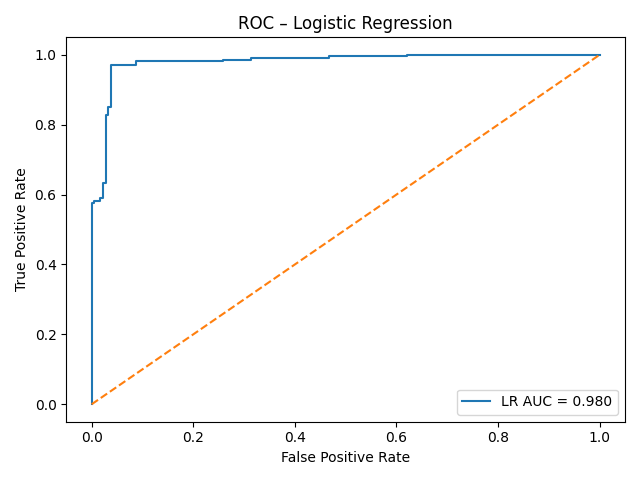
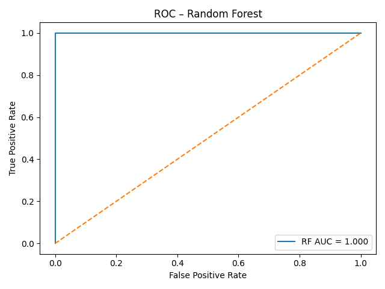
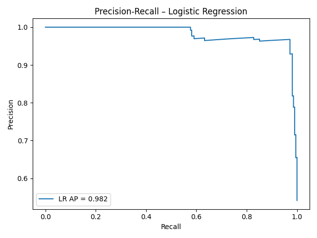
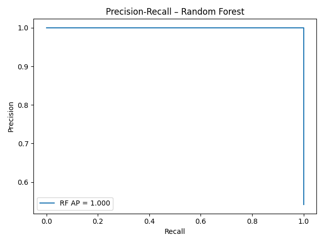
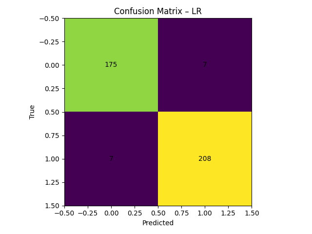
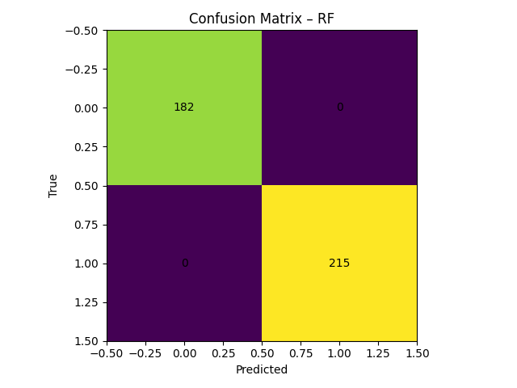

# Autism Predictor – Summary\n\n## Models Compared\n- Logistic Regression\n- Random Forest\n\n## Key Metrics\n- **LR**: ROC AUC = 0.980, Average Precision = 0.982\n- **RF**: ROC AUC = 1.000, Average Precision = 1.000\n\n## Curves\n\n\n\n\n\n\n## Confusion Matrices\n\n\n\n## Notes\n- ROC AUC summarizes ranking quality; higher is better.\n- Average Precision emphasizes performance on the positive class if classes are imbalanced.\n- Use EDA insights to decide which features to engineer or drop.